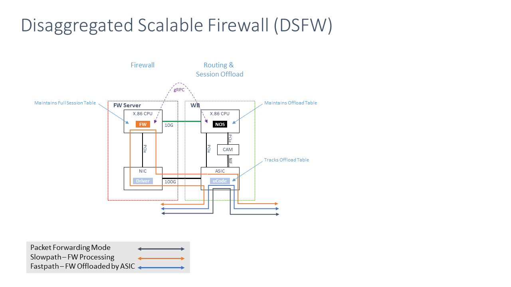
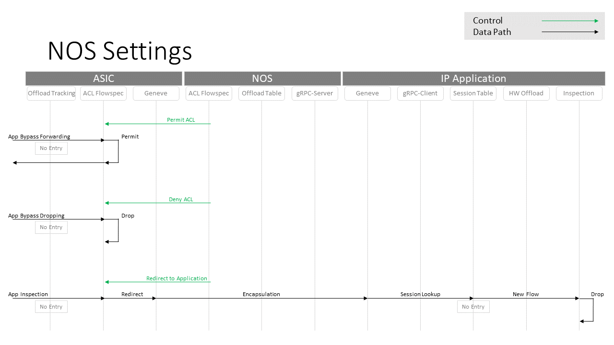
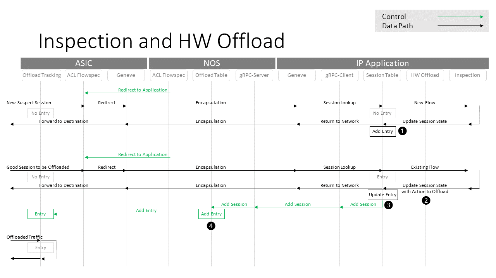
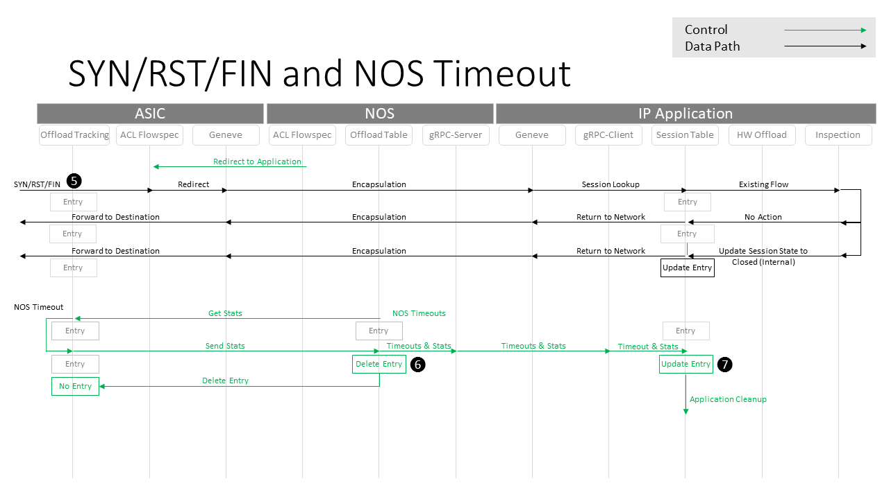
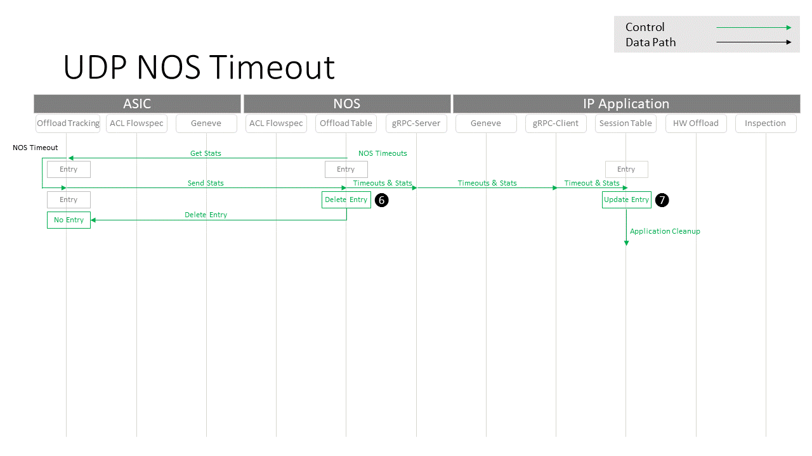
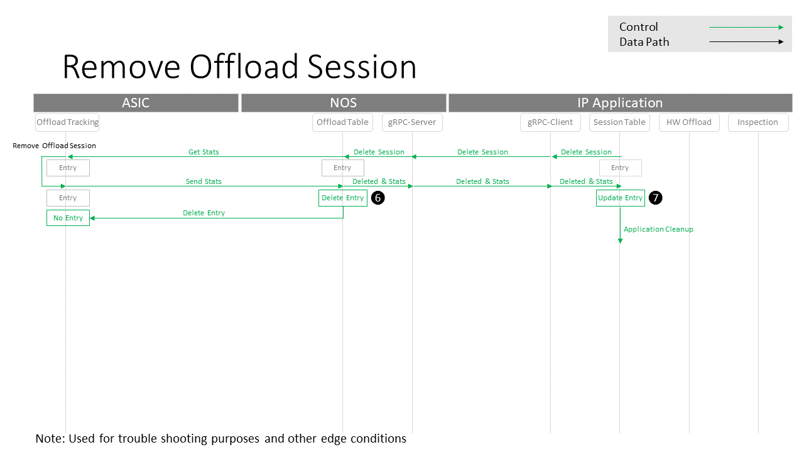
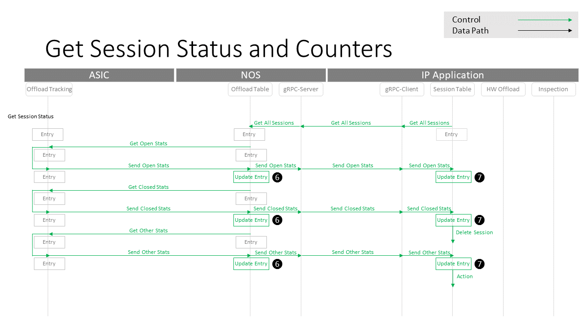

# Sequence Diagrams 

## Introduction
The Open Offload API can be used for session offload in a Disagregated Scaleable Firewall (DSFW) Application.
This page will show the use of the API in the context of the DSFW to help explain its constiuent parts.

## High Level Archiecture

## NOS Settings

## Inspecting Session Offloag

## TCP  SYN RST FIN Timeout processing

## UDP Timeout processing

## Removing Sessions

## Get Status and Counters

