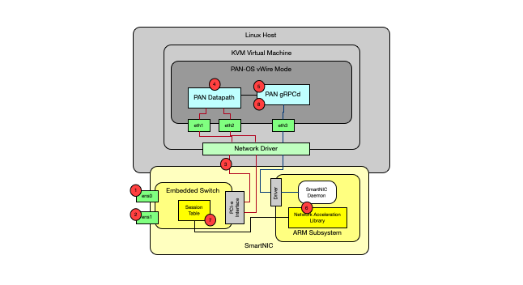

# Generic SmartNIC Architecture for OpenOffload

## Overview
The following presents a generic SmartNIC architecture for OpenOffload and its interaction with an applicaiton. To make discussion of the architecture and the interaction between the application and the SmartNIC more relevant, we use information from a Palo Alto (PAN) vFirewall integration in the example. The steps in the packet flow are presented to help SmartNIC developers design their implementations.

## Setup with virtual functions (VF)
The firewall is connected to the SmartNIC through three virtual functions. The first two are for the data path interfaces. The third is used as a control channel to the SmartNIC. 

## Steps in the packet flow
The diagram below shows the diagram for the packet path of though the SmartNIC and the firewall.

### Description of Steps
1. A packet arrives at ens0
2. The emdedded switch does a lookup in the session table for the session. If the session is present and the action is offload the packet is sent out ens1. The inverse is also true for packets arriving at en1.
3. If the packet does not exist it is sent to the firewall. Note: All TCP control packets are always sent to the firewall. The firewall is responsible for managing session state.
4. Packet is sent to the firewall, if the packet is not suitable for offload (short flow or needs threat inspection it is processed by the firewall.
5. If the session is offloadable the session information is sent to the PAN gRPCd process that calls the SmartNIC daemon with the addSession call to add the session to the SmartNIC session table on the embedded switch.
6. The SmartNIC daemon updates the SmartNIC session table and sets a timer for the session (in both directions for TCP flows).
7. Once the timer expires the SmartNIC checks the flows in both directions to see if there have been any packets since the last check. If there have been packets the SmartNIC continues to forward packets. If there have not been any packets the SmartNIC sends an update to the firewall with the packet and byte count of the offloaded packets and removes the session from the session table.
8. The firewall receives the closed session message and updates the session statistics and goes about the session close process.

Copyright (C) 2021 Palo Alto Networks Intellectual Property. All rights reserved.

