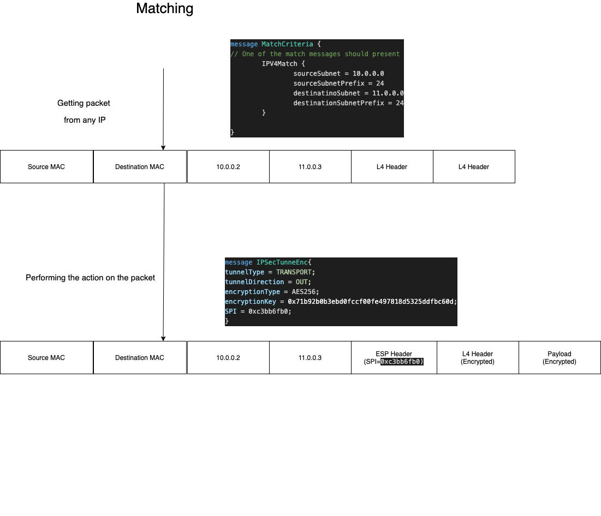

# IP Tunnel Offload

-------- DRAFT -----------

With openOffload it will be possible to also offload IP Tunnels into the underlying hardware.

A service called `ipTunnelTable` will be introduced, for CRUD operations on the offloaded sessions.

Through this service, it will be possible to offload several kinds of IP Tunnels, where the common configuration between them is the `match` criteria, which indicates which packets will be matched and go to a tunnel.

The API will also allow the definition of switching between tunnels with decapsulating and encapsulating appropriate to the tunnel type for the incoming and outgoing traffic.


# Offloading Rules

With openOffload, the user can request to match the packet encapsulate it on a tunnel, this will be done by providing matching criteria, tunnel properties and the next action to perform.

```
message ipTunnelRule { 

  MatchCriteria match_criteria = 1; // When hitting this match, 

  ACTION nextAction = 2; // What we'll do after matching the packet, shuold we 
                         // keep process it or we'll just forward it 

  oneof tunnel { 
      IPSecTunnel ipsecTunnel = 3;  
      GENEVE geneve = 4;
      VCMPNat NAT = 5;
  };

}
```

Each ipTunnelRule inserted will include *match* determines rule matching. Upon match tunnel provided by the *tunnel* 
field will be applied to the packet.

`nextActinon` field will determine what will happen to the packet after applying the tunnel, with two possibilities: *recirculate* indicates packet will overgo again the tunneling subsytem, and another tunnel rule may be applied. *forward* indicates that the packet will be forwarded directly from the device, without the  process of any other tunnel.

To summarize the flow, see the following diagram:


#### Tunnel ID

As a response to `ipTunnelRule` creation, the offloading device will send back a unique 32-bit identifier to the tunnel - **tunnelId**.

The tunnelId will be used for any tunnel action: getting tunnel operational data / deleting tunnel / etc

## Packet Matching

Matching of the packet can be based on several matching criteria, interface, IP, VRF, etc.

The matching criteria are comprised of three parts:

1. IP packet fields  - MAC, IP's, etc
2. Specific header matching: GENVE / VXLan / IPSec, etc.
3. Tunnel Matching: Matching packets according to their *last* match. More information on it in *Tunnel Chaining* section.

```
message MatchCriteria {
    // In case it's not present, untagged traffic will be matched
    string ingress_interface = 1; // Optional field, in which interface this tunnel will be encapsulated

    MacPair macMatch = 2; // MAC of the packet itself

    oneof ip_match {
      IPV4Match ipv4Match = 3;
      IPV6Match ipv6Match = 4;
    }

    string vrf = 5; // Optional field, not indicating VRF means that 
    // the match will be on default VRF 

    tunnelId tunnelID = 6; // Match on specific tunnel
    
    // Tunnel Matching
    oneof match {
      IPSecMatch ipsecMatch = 7;
      GeneveMatch geneveMatch = 8;
      VXLanMatch vxlanMatch = 9;
      GRE greMatch = 10;
    }

}
```

This matching structure is intended to provide maximum flexibility to the user, that, for example - can match on specific VXLan VNI & Inner Mac, and only then perform IPSec encryption (or any other action).

Field absence will count as wildcard matching. Fields not containing any values will be matched on any value received. e.g. Not providing ipv4/ipv6 match, will make the tunnel matched on any IP received by the device.

Let's take a look at the following packet:


*All of the matches below will match this packet:*

```
Source IP: 1.2.3.0/24
VXLAN Packet {
   VNI: 466
}
```

*Source IP & VNI Match, Destination IP is not provided - matching on any destination IP*

```
VXLAN Packet {
}
```

*Just specifying that packet is VXLan packet is enough, done by matching VXLan without any field in message*

```
Source IP: 1.2.3.0/24
Destination IP: 5.5.5.0/24
VXLAN Packet {
   Source MAC: 0x102030405060
}
```

*Source & Dest outer IP match, inner source MAC match*

## Packet Encapsulation / Decapsulation

After packet matched, it should be encapsulated / decapsulated according to the offloaded tunnel.

Tunnel configuration can be unidirectional or bidirectional, depending on the tunnel characteristics.

This is the tunnel part in the ipTunnelRule:

```
  oneof tunnel { 
      IPSecTunnel ipsecTunnel = 3; 
      GENEVE geneve = 4;
      VCMPNat NAT = 5;
  };
```

Each tunnel type is introduced by message.  

In case of bi-directional tunnel, the tunnel encapsulation will determine the match on the reverse side (e.g. NAT).

In case of uni-directional tunnel, tunnel definition will be for only ecnapsulation / decapsulatio nof tunnel.

GENEVE is a classic example of bi-directional user - where the offloaded device can device to just encapsulate / decapsulate geneve.

```
message GENEVE {
  oneof {
    GENEVEEncap geneveEncap = 1;
    GENEVEDecap geneveDecap = 2;
  }
```

*Upon a match, user decide to perform encapsulation / decapsulation, GENEVE is comprised of two distinct messages, 
choosing one of them decide about the tunnel operation*

NAT is an example where the device is both encapsulating / decapsulating the tunnels.

```
message NAT {
  SourceIP sourceIP = 1;
}
```

*In NAT example, ipTunnelRule will be used for both encapsulation / decapsulation*


**Match** is the only indicator for going into tunnel encapsulation / decapsulation.
While wanting to perform decapsulation of packet in uni-directional tunnel (e.g. the GENEVE Decapsulation in the example above), a GENEVE match **MUST** be on MATCH criteria (the same applies for IPSec, VXLan, etc)

### Tunnel Chaining

Tunnel chaining is possible with tunnelOffload, making a packet overgo several tunnels encapsulation / decapsulations.

According to the following chart:


Upon receipt of packet into the offloading device, it will be matched and tunnel will be applied. 

If the `nextAction` equals to `RECIRCULATE`, the packet will be process via the matching logic again, and if match will be found - another tunnel will be appliwed ot hte packet.

This iterative process will occur until: one; packet isn't matched via the matching logic. 2; the next action equals to `FORWARD`. That will yield to immediate forwarding of the data. 

Consider the following example:


While first match of packet **MUST** be based on IP's, there's a possibility to use "TunnelID" as the match critieria.

Rules having "TunnelID" in their match criteria can only be part of tunnel chaining, and will applied on packet from the second tunnel and afterwards.

Consider the following example:


The advantage of using the "TunnelID" as a match, is the ability to know for sure that after some tunneling, the second will happen for sure.


## Capabilities

Capabilities are needed so the user can detect which features are available with tunnel offload,
user can detect which features are available with tunnel offload, both the tunnel capabilities & matching capabilities of the devic

That's the response the user will get in order to know which capabilities available for it:

```
message CapabilityResponse {
  // We'll have capability for matching, and for every tunnel

  message MatchCapabilities {
    bool ingressInterfaceMatching = 1; // Is interface can be matched for encapsulation / decapsulation
    bool vxlanMatching = 2; // Match with VXLAN VNI
    bool geneveMatching = 3; // Match with geneve can happen
    bool vrfMatching = 4; // Is vrf matching possible
  }

  MatchCapabilities matchCapabilities = 1;
  
  message IPSecCapabilities {
    repeated IPSecTunnelType tunnelTypeSupported = 1;
    repeated AUTH_TYPE authSupported = 2;
    repeated ENC_TYPE encryptionSupported = 3;
  }
  
  IPSecCapabilities ipsecCapabilities = 2;
  
}
```


## Examples

#### Offloading IPsec Tunnel

In the following example, IPSec tunnel processing is offloaded into the device. 

IPSec is a special example where two offloads should be performed to the device, one for egress and one for ingress - since there's different SA (Security Association) per direction.

**Ingress Tunnel**

For egress flow, the following example can is offloaded into the device



**Egress Tunnel**

For egress flow, the following example can is offloaded into the device


