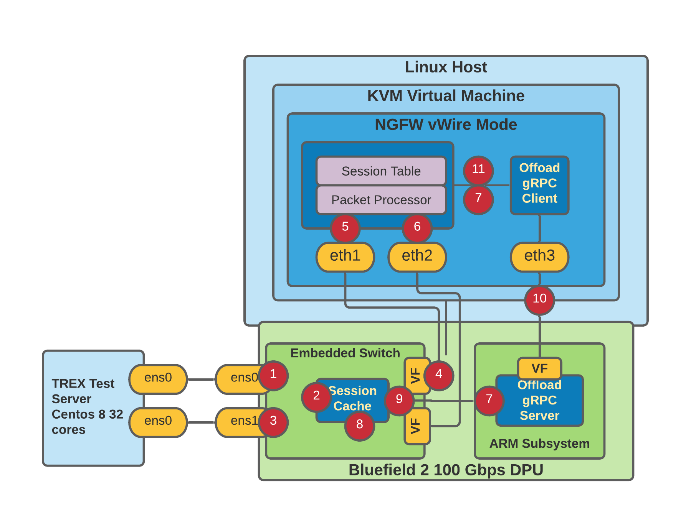

# Implementation Guide for OpenOffload

## Introduction
This document is intended for implementation engineers who are working to implement OpenOffload on a new hardware device. There is sample code in the [Session Offload Github Repository](https://github.com/att/sessionOffload/tree/master/openoffload/cpp) and Nvidia has made their implementation available in the [Firewall Offload Github Repository](https://github.com/BodongWang/firewall_offload). It is intended for this to be a companion document to the code examples to provide additional background for implementation engineers.

## Packet Walkthrough

This section gives a packet walkthrough of the system to provide context for the overall architecture

<ol>
<li>Packet arrives at ens0 from test server</li>
<li>The embedded switch does a lookup in the session cache for a session with a matching 6-Tuple. The six tuple is Source-IP, Source-Port, Destination-IP, Destination-Port, Protocol-Type (TCP or UDP) and InLif (VLAN). </li>
<li>If there is a match for the six tuple and the action is “FORWARD” the packet is sent out ens1. Other actions may also be speficied and similarly their action would be taken (e.g., DROP, MIRROR, SNOOP)</li>
<li> If the packet does not have a match in the session cache it is sent to the firewall. Note: All TCP Control packets are sent to the firewall as the firewall does security state analysis on TCP Flows. The firewall also manages the Session state of traffic.</li>
<li>The packet is processed by the firewall, the firewall will continue to process packets from the session until it determines the application type of the session. The firewall decides if the packet can be offloaded safely, this is the case when it is not possible (encrypted traffic) or not necessary (audio, video traffic) to do threat inspection on the session. In addition the firewall makes decisions, to preserve the space in the session cache, if the flow is short or slowly varying it is not offloaded to the offload device.</li>
<li>If the packet is not suitable for offload, after processing it is sent out egress interface as a normal firewall session.</li>
<li>If the session is offloadable the session information (SessionID and 6 Tuple) is sent to the PAN gRPCd process that calls the DPU daemon with the addSession call to add the session to the DPU session cache. Multiple sessionRequests are bundled into a single addSession call up to a limit of 64 sessions per addSession message. </li>
<li>The DPU daemon updates the DPU session cache and sets a timer for the session (in both directions for TCP flows). The incoming packets for this session are now offloaded as in step 3.</li>
<li>When the firewall receives the end of flow (TCP-FIN) the firewall will mark the session as closed but will not have the session statistics for the offloaded flows. On the offload device packets will no longer be arriving for this flow, and when the timer expires the DPU checks the flows in both directions to see if there have been any packets since the last check. If there have been packets the DPU continues to forward packets. If there have not been any packets the DPU removes the entry and notifies the offload server with the sessionID and the session statistics.</li>
<li>When the offload server receives the closed sessions it sends an update to the firewall with the sessionID, packet and byte count of the offloaded packets. The DPU offload server will batch up to 64 sessionResponse objects in the getClosedSession stream for this notification.</li>
<li>The firewall receives the closed session message and updates the session statistics and goes about closing the session and sending the session to the logging system.</li>
</ol>

## Role of Session Cache in Open Offload

The session cache that is maintained by the offload device for the Open Offload system is a key component of the system. This document describes the functionality of the session cache and how it interacts with the rest of the system,

The role of state management for all flows in the system is provided by the Next Generation Firewall as the firewall performs several security checks and manages the lifecycle of all flows in the system.This requires all TCP state to be delivered to the firewall even for offloaded flows.  For UDP flows the firewall will periodically check with the offload device session table to determine the health of the UDP session. The rate is determined internally by the ager in PAN-OS.

### Design of Offload Session Cache
The session cache that is maintained by the offload device is a cache and not a fully functional session table. The role of the session cache is to maintain the session information of the flows that are to be offloaded. The session cache is updated through the addSession gRPC message. Once an entry is made in the session cache the offload device will check incoming packets against the session cache to determine whether the session is offloaded or not. As part of the session cache each entry has a timer with an expiration time.

There are default times for UDP and TCP flows set for ITO in PAN-OS:
<pre><code>
          $ show intelligent-traffic-offload status
</code></pre>
These can be adjusted with:
<pre><code>
    $ set session intelligent-traffic-offload tcp-timeout <1-9999>
    $ set session intelligent-traffic-offload udp-timeout <1-9999>
</code></pre>
Default values should be selected to be shorter than the NGFW timeouts to keep the system flowing efficiently.  The defaults within PAN-OS can be viewed with:
<pre><code>
    $ show session info
</code></pre>

These defaults are overridden on an individual basis by entries in the addSession message. The only state the session cache has is the session information, sessionID, 6-Tuple and the associated timer with the session.

To keep the cache synchronized with the session table in the NGFW we take an “eventually consistent” approach as a transactional synchronization would not be possible. When a timer on a flow expires it checks to see if any packets have arrived for that flow (a session is made up of flows in both directions for TCP) since the last timer event. If a packet has arrived the timer is just reset. If a packet has not arrived that flow is marked as closed and the session is removed from the cache and the sessionID and the statistics for the session are sent over the getClosedSessions message to the firewall.

The internal design of the session cache is left to the offload device. The only requirements made by the open offload system is that it provide a timeout mechanism to remove flows from the session table and notify the NGFW that the flows are "closed", with the appropriate flow statistics.

The session cache does not need to be concerned if it closes a flow/session early, say due to a temporary network outage. The NGFW will update the statistics and continue processing packets for the session. If the session is a very long session it may be offloaded again.

### Consistency Checks
While the system is designed to be eventually consistent there do need to be some additional checks for both TCP and UDP sessions to account for occasional message (gRPC) loss or network packet loss. 

##### TCP Checks
If the NGFW get the TCP session close sequence and the session is offloaded and there has been no messages from the offload device the NGFW will issue a deleteSession message to explicitly close the 
session on the device, and get the session statistics if they are available. 

##### UDP Checks
UDP sessions have no state so a heuristic check needs to be performed on UDP flows to make sure the state is being synchronized correctly between the offload device and the NGFW. The offload client will periodically do a getSession call on UDP sessions to ensure that the offload client and offload device are synchronized.

## API Overview
The C/C++ API is documented in the [SessionOffload Github Documentation](https://att.github.io/sessionOffload/). This section is intended to provide additional background and implementation notes.

### Add Session
Add session is one of the two primary calls for the system, the other being getClosedSessions. The add session gRPC call sends batches of sessions to the offload device. The current batch size is 64. The NGFW fills the add session call from a ring buffer as rapidly as possible. It might send the same sessionID/6 Tuple more than once and the offload device should mark the response with a duplicate message and ignore the session.

### Get Closed Sessions
Get closed sessions is the other primary call in the system. This is implemented as a gRPC stream, once the offload device opens this channel it should just stream batches of closed sessions (maximum batch side is 64) to the NGFW. It is recommended that this is done in a separate thread to optimize performance.

### Get Session
Get session can be called by the firewall for some debugging operations and to do periodic checks on the state of UDP flows in the session cache. If the system is only running TCP flows, the get session call should not be seen in the logs because it is not used. It will appear when UDP flows are being offloaded

### Delete Session
Delete session is only called by the NGFW to correct an error, either the NGFW did not receive a closed session message or the offload device did not send it and the NGFW has timed out the offloaded session and needs statistics. If the system is running correctly,  delete session should not be seen in the logs.

## Testing the System

### IPERF3

It is recommended that initial testing be done with IPerf3, this will allow the developer to start with single flow offloads and then work up to larger number of flows. A single IPerf3 session can reach about 30Gbps of traffic to go beyond this multiple IPerf3 streams will need to be used.

The two commands below will run 16 IPerf instances and generate close to 100Gbps of traffic.

#### Client Side IPerf3 Example
<pre><code>

	for i in {1..16} ; do iperf3 -c 192.168.79.4 -t 120 -p$((5000+i)) | grep -Po '(\d+\.\d+)(?=\sGbits.+receiver)' & done

</code></pre>

#### Server Side IPerf3 Example

<pre><code>

	for i in {1..16} ; do iperf3 -sD -p$((5000+i)); done

</code></pre>

### TREX

To do more sophisticated testing, [TREX](https://github.com/cisco-system-traffic-generator/trex-cores) is suggested as it is open source and has provided a good testbed for different types of traffic.

#### Simple HTTP Streaming Test

The following command will generate about 100 Gbps and about 150,000 sessions of traffic with TREX if the test server has sufficient CPU. **NOTE:** To enable this in NGFW the Application Override must be configured with HTTP and port 80.

<pre><code>

sudo ./t-rex-64 -f astf/ito_single_flow.py --astf -m 1000 -c 16 -l 1000 -d 240 -t size=2048,loop=100

</code></pre>

The Python Code in the command is in the TREX directory. It should be copied to the TREX astf directory as it references PCAP files from TREX.

#### Enterprise Traffic Test
The following command will generate about 100 Gbps and 250,000 sessions of traffic with TREX if the test server has sufficient CPU. NOTE: To enable this in NGFW the Application Override must be configured with HTTP and port 80.

<pre><code>

sudo ./t-rex-64 -f astf/ito_enterprise.py --astf -m 10 -c 16 -l 1000 -d 240 -t size=2048,loop=100

</code></pre>

The Python Code in the command is in the TREX directory. It should be copied to the TREX astf directory as it references PCAP files from TREX.

#### Session Insertion Rate Test
The following command will generate ~5000 insertions/sec for testing session insertion rates and a corresponding offload of ~94 Gbps. You can adjust the insertion rate by changing the -m parameter. TREX will insert at that rate until it gets near saturation and then it will back off. 

<pre><code>

sudo  ./t-rex-64 -f astf/ito_single_flow.py --astf -m 5000 -c 16 -d 600 -t size=2048 ,loop=1000

</code></pre>

